# 会议笔记

## 2020/2/26

### AIS-AI

#### PCIe Switch

#### DCGM

- DCGM (Data Center GPU Manager):

##### SM 分配策略

- cuda sample mm as example, 调整 grid size， 逐步提升 threadblock

#### HARP

异构资源池 Heterogeneous Architecture Resource Pool

- 解决用于机器学习的 GPU 集群中, GPU 利用率低, 和资源碎片化的问题.

#### HARP: Related Work

- DNN cluster schedulerss
  - Bytedance: ByteScheduler' SOSP19[8]
  - Tiresias' NSDI19[9]

- CUDA API remote / forward
  - Tecent: GaiaGPU' ISPA19[10]
    - vCUDA, not remote
  - VMware: Bitfusion (FlexDirect)
  - Orion: Orion
    - Do not have effective scheduling

#### TRTIS

TensorRT Inference Server
- TensorRT: NVIDIA 推理模型优化器

## 2020/3/11

### 论文 貌似是和神经网络有关

#### 霍夫曼编码与神经网络

### 网络剪枝

本质上就是重要性排序。

- 基于度量标准的剪纸
  - Weight
  - Activation
  - Gradient
  - Energy Consumption
  - Latency
- 基于重建误差的剪枝
- 基于稀疏训练的剪枝
- 随机修剪

### Exploring Shared Virtual Memory for FPGA Accelerators with a Configurable IOMMU

#### Motivation

- Drawbacks of copy-based memory sharing
  - Static splitting on limited memory
  - Not suitable for pointer-rich application
  - Coherency problems reduce performance
- IOMMU is not properly used
  - Lack of software support

#### Contribution

- A softare SVM manager running on the host.
- A parameter......

#### Architecture


#### SVM Management

- Flexible configuration
  - Range of mapped memory
- Worker thread
  - Pin allocated pages

#### IOTLB


#### Single Cycle L1 TLB

- Full-associated
- Flexible
- Low latency (1 cycle)
- High resource consumption
- In practice, L1 TLB is limited to 64 entries (to achieve acceptable frequency)

#### Multi-Cycle L2 TLB

- Set-Associated
- ...

#### Hybrid TLB

- Non-block translation
- Reordering when burst < L2 TLB

#### Real Traffic Patterns

- Pointer-Chasing (PC)
- Random Forest Traversal (RTF)
- Mem Copy (MC)
- Sparse Matrix-Vector Multiplication (SMVM)

## 2020/3/18

### Rich RT Process = RT Process + Rich (Linux) Features


### gVisor & Firecracker


> Code Coverage 可以用韦恩图来表示不同框架的 Code Coverage。
> 哪怕一个工程问题，也可以跑一跑，测一下数据，总结一些结论。

进程级容器性能 vs 虚拟机性能？


容器竟然比虚拟机慢？

### Serverless applications booting are slow!

- The execution takes several seconds while the initialization takes several seconds, too...
- Sandox initialization + application initialization (JVM, Python interpreter...)


总之就是 Serverless 应用启动速度太慢了。

#### Three Paths


总之就是能共享就共享。

- Warm Boot (middle path)
  总之就是 Copy On Write 的思想。
  
- Fork Boot (fast path)
  - Vanilla fork is infeasible:
    - Only single-thread is supported.
    - Consider thread0 calls fork while thread1 holds a mutex, what will happen?
    - The forked thread has a locked mutex which no one will release it!
  - Vanilla clone is infeasible:
    - MAP_SHARED violates the security constraint.

解决方案


#### Namespace

- OverlayFS: in-memory FS, copied automatically by sfork.
- And Log need persistency.

### Migration Support for SR-IOV?


迁移的时候，SR-IOV 无法热迁移，要迁移的话，要把 Guest Module 切换为 VirtIO 模式。

### Direct Timer and IPIs


### X-Dragon


### Vulnerability Fixing: one by one

- Safety of the VMFUNC instructions

## 2020/3/25

### C-LSTM: Enabling Efficient LSTM using Structured Compression Techniques on FPGAs

RNNs 应用场景

- Machine Translation
- Voice Control
- Music Composition
- Image Caption

LSTM - Long Short Term Memory neural Network

Google LSTM

  - Large Model Size
  - 总之模型越来越大 所以在模型层面做压缩 再是硬件优化

Compression Techniques Overview

  Model Compression Techniques
  - Parameter Pruning
    如果只是减少参数的话，会
    - Unbalanced Workload
    - Extra Storage Footprint
    - Irregular Memory Access
  - Quantization
  - Structure Matrix
    结构化矩阵 实际上用的是循环矩阵
    - Circulan Matrix
    - Circulant Convolution 总之是把矩阵划块

  Model Training
  - Varying Circulant Matrix Block Size k
    trade off between compression ratio and ?

Operator Scheduler

Synthesis Backend

#### Conclusion

Circulant Matrix Compression

LSTM Inference Engine 

### AEP & JVM

- Optane 方面研究
- Optane + JVM

#### Espresso: Brewing Java For More Non-Volatility with Non-volatile Memory

Two persistence management approaches in Java

- Fine-grained Persistence with PC
  - Using a separate native NVM environment to store persistent data
- Costly management of two heaps
  - real data manipulation only accounts for 1.8% over the whole execution time

Persistent Java Heap


  - Fine-grained Persistence with PJH
    - adding an additional persistent heap
  - Metadata area
  - Name table.
  - Data heap and Klass segment.
  - APIs: createHeap, loadHeap, pnews

#### AutoPersist: An Easy-To-Use Java NVM Framework Based on Reachability

AutoPersist - durable root
- All objecs reachable from the durable root set must be in NVM.
- All objecs reachable from the durable root set must be automatically persisted when modified.


AutoPersist - Moving object
- Moving object at runtion


AutoPersist - Moving object

#### An Empirical Guide to the Behavior and Use of Scalable Persistent Memory

4个使用 Optane 的建议


## 2020/4/1

- High-density Multi-tenant Bare-metal Cloud
- Lightweight kernel isolation with virtualization and VM functions

### Optimizing Nested Virtualization Performance Using Direct Virtual Hardware

嵌套虚拟化

- A technique to run a virtual machine (VM) inside a VM

嵌套虚拟化性能过差

- Single-level virtualization performs close to native execution
- Many times(10~) slower in Nested Virtualization

Direct Virtual Hardware


- Virtual-passthrough
  
  - Place virtual I/O devices at L0 hypervisor
  - Support running many VMs without special hardware
  - Support VM live migration
- Virtual Timers
  - Additional Per-vCPU virtual timer at L0 hypervisor
  - Remap the virtual timer to hardware timers for nested VMs

> Posted Interrupt
> - Hardware feature allowing Exitless interrupt receiving
> - PI descriptor and PI notification vector (in VMCS)

- Virtual IPI
  
- Recursive DVH
  - DVH is easily set up in multiple levels of nested VMs
  - Combined mappings 

### How to Copy Files

华为和VMware？

#### New Thrends

- Open-Channel SSD
- In Storag Computing
- Zoned FS 对于机械硬盘特别优化的文件系统？

#### Generation of filesystems

0. No systems at all.
1. Early random access.
2. Early organization (aka folders)
3. ...

#### Next Generation and New File systems

- XFS, ZFS, BtrFS, BetrFS
- New FS:
  - F2FS, for flash storage
  - ZoneFS, for zoned namespace (ZNS) NVMe SSD
  - for optane?

- XFS
- ZFS
  - Features
    - Atomic COW snapshots
    - Per-block checksuming
    - Self-healing redundant arrays
    - Volume management
  - Legaal problem: Oracle. linus说别用
- BtrFS
  - Implemented with B+ tree
  - Low Performance compared to others
  - Many features are very buggy
- BetrFS
  - B epsilon tree

#### 修改 B epsilon tree 来提升空间利用率？

B epsilon - DAGs and Small Writes

- Copy-on-Abundant-Write
- Performance Goals

#### Conclusions

- transform copy-on-write into copy-on-abundant-write

## 2020/4/15

### GPU Code Generation with Scheduling

```python
# compute description
def vector_add(A, B):
    C = compute((...))
```

```cpp
/* Real code running is cpp. */
```

总之是自动优化。大多是匹配一下某种模式。

### Related Works -- Halide

- Separate Compute and Schedule
- Generate low-level code automatically
- Focus on image-processing
- Auoscheduler mainly

实际上就是模式匹配？

### Related Works -- TVM

- Separate Compute and Schedule
- Generate 

### Limitatinos of Writing Schedules

- Many primitives to choose.
- Complex combinations & huge parameter space.

大概意思是随便变一下方法，可能

### Motivations

An Ideal Framework:

- Auto-optimization
- High-performance
- Portable CPU 和 GPU 上都能用
- No low-level programming
- Shor development time

### FlexTensor Workflow


### Static Analysis

### Schedule Space Generation

- 总之肯定要剪枝，并且要把小循环组合成大循环。

### Quatization

两个主要研究方向

- 权值共享
- 权值精简
  - 从1bit到16bit都有，1bit极限方案往往精度损失较大

### Quantization and Training of Neural Networks of ...

谷歌的论文

之前方法的问题

- benchmark本身有很多冗余，容易压缩。

### Quantized Inference

## 2020/4/22

### Rendering Redundancy

渲染冗余？

#### Motivation Macro


#### Motivation Micro

### Side-effects brought by redundancy

- Memory bottleneck
- High energy consumption 手机......
- CPU consumption 比如，GPU本身没有编译器，是放在CPU上运行的，所以GPU重复处理命令，CPU也得帮忙。
- Network consumption for API-forwarding systems 总之，数据重复......

### Current development

- Hardware level
  - Transation elimination
  - 把粒度变粗
- Software level
  - LiveRender
  - 通过AI的预测来减少渲染？
  - gRemote......

### Rendering pipelines


### The appearance of Redundancy

很多步骤都在产生冗余。每个buffer都可能会有冗余。由于GPU是无序处理的，很难判断哪个和哪个是冗余。（两个相减做不了，因为数据可能无序地产生）

- GPU commands and data among frames (command processor)
- Vertex attributes have many similarities within tiles and frames (vertex cache)
- Primitives and Tiles are same. (Primitive assembly, Geometry shader)
- Fragments are same. ()
- Some Fragments are hidden by others. (z-buffer)

### Differences among these technologies


### How to solve hidden redundancy

- z-buffer (happening after Fragment Shader)
- Early z-buffer (happening before Fragment Shader)
- Early Visibility Resolution

### Early Visibility Resolution


加的东西是深色的那三个。

### Challenges

- How to combine primitives with z-buffers and primitives without z-buffer?

### Solutions: FVP

- In rendering architectures, primitives without z-buffer refers to translucent ones (NWOZ). Primitives with z-buffer refers to opaque ones (WOZ).
- Authors use a symbol called Zfar referring to the furthest visible point. If any...


### SplitX: Split Guest/Hypervisor Execution or ...

Motivation

- Virtualization overhead due to VM-Exit
- VM-Exit cost
  - Direct cost
  - Indirect cost
  - Synchronous cost


### Implementing Exits on SplitX

- Classify exit reasons into several categories
  - Non-exits
  - Synchronous exits
  - Asynchronous exits

### Approximation on Contemporary HW

- Inter-Core Signals
  - IPI or polling
- Manage Resources of Other Cores
  - E.g. mov cr0, rax
  - The guest sends its request to the hypervisor and spin-......

### Motivation

- Bare metal vs Virtualization
  - High performance and physical isolation
  - Compromise cloud manageability. E.g. live migration
- Direct Interrupt Processing
  - Posted interrupt mechanism
- Seamless Live Migration and Manageability

## 2020/4/29

### 安卓 trust zone 虚拟化

- EL0

- EL1

- EL2

#### Trust Zone 硬件级安全解决方案

总之手机有各种安全问题，操作系统的安全性很重要。

把一些重要操作，如身份验证、密码存取放到安全环境下进行

Trust Zone 同时运行一个安全OS与一个普通OS

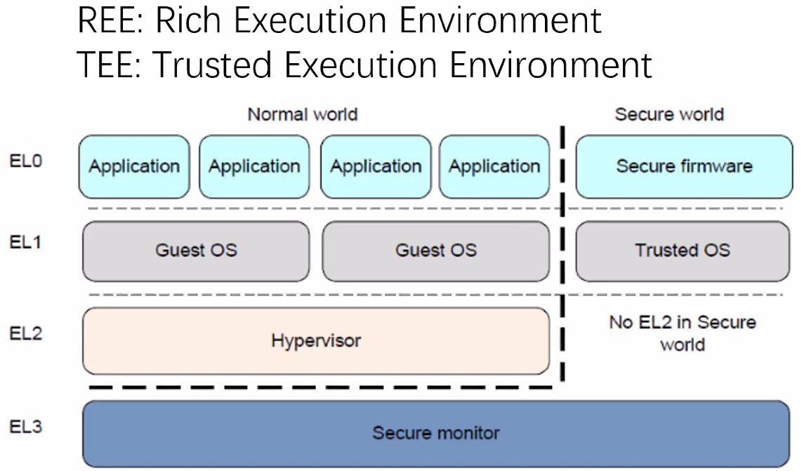

#### ARM TrustZone

内存分区 TrustZone divides memory into two parts: saft memory and normal memory.

外设分区 For I/O devieces and interrupts, ...

#### Application

- IPhone 5s 指纹识别的基础
  - 基于TrustZone等技术实现Enclave与外界强隔离
- 三星TIMA
  - 动态内核完整性保护
- 防止手机root

#### TrustZone's challenge

- ROP (return-oriented programming) 在看不见的地方做ROP攻击
- 侧信道攻击 利用侧信道信息获取数据
- Clkcrew 攻击者利用ARM里面调频的机制，向TEE注入错误
- X-Lab TEE回滚攻击

### vTZ: Virtualizing ...

在 ARM TrustZone 上做虚拟化。

- smc指令 算是安全模式的切换命令

#### Goals

- Multiplexing thee secure world for guest VMs
- Compatibility for existing software in secure world
- Minimizing ...

#### Alternative Designs

Design Choice I

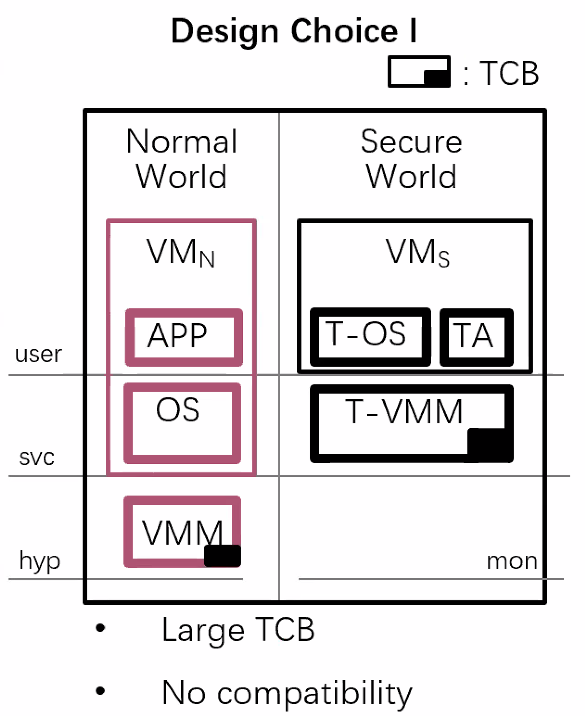

- T-VMM (trusted VMM) in the secure world
- VMM in the ...

Design Choice II

直接不用 TrustZone 而是在 NormalZone 里模拟

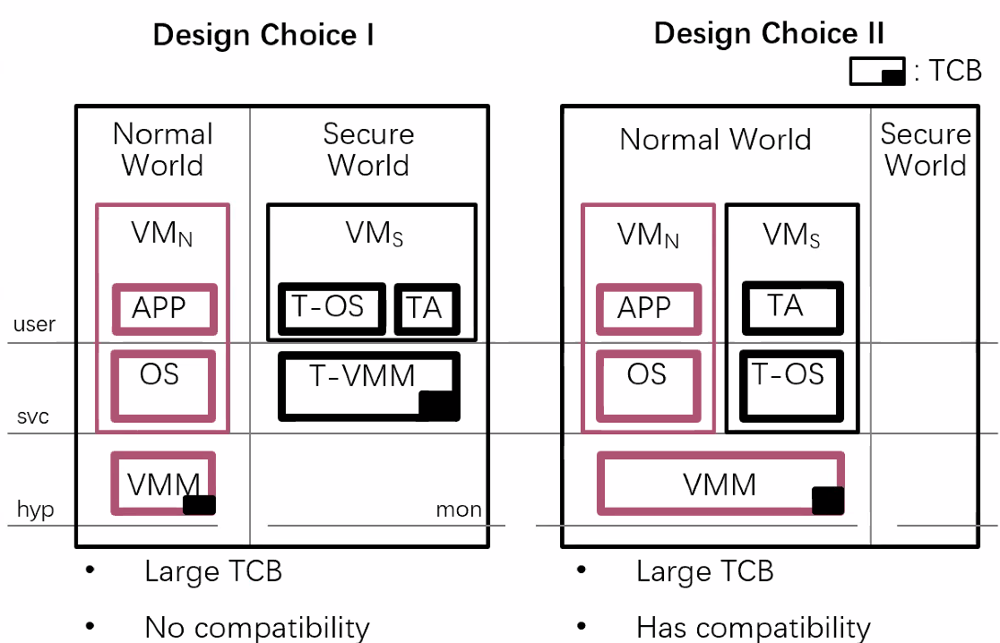

- Virtualize guest secure world in the ...

Design Choice III

两种结合

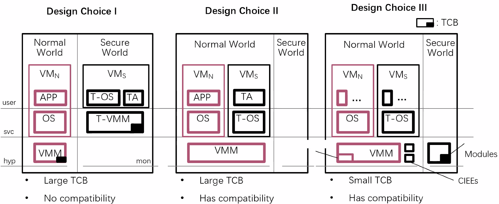

#### Threat Model

Assumption

- Any guest may be an attacker.
- ...

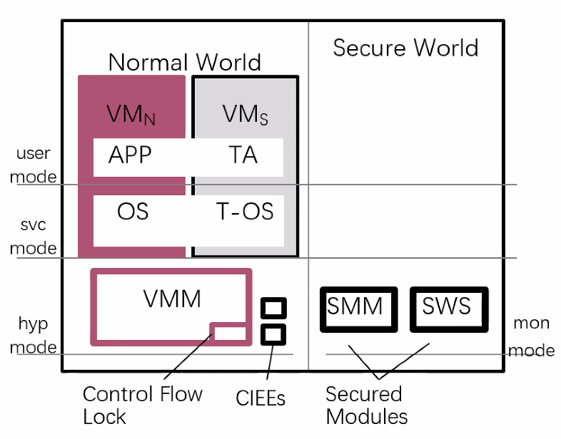

- Emulate guest normal world ...

#### P1. Only secure world can access secure memory

- Challenge
  - Untrusted VMM controls all memory mappings
  - Map one guest's secure memory to its normal world or another guest
  - Map one guest's secure memory to VMM's address space
- Solution
  - SMM exclusively ...

- Two kinds of mappings to the physical memory
  - Stage-2 page table maps guest physical address to physical address.
  - Hyp page table maps virtual address to physical address for VMM

#### SMM Secured Memory Mapping

- SMM exclusively controls the mapping
  - Replace all page ...

#### P2 'smc' must switch to the correct world

- Challenge
  - Untrusted VMM controls the scheduleing of all VMs
  - 'smc' may switch to a malicious VM
  - 'smc' may switch to a wrong entry of guest secure world
  - ...

#### SWS (Secured World Switching)

- SWS Interposes switching between a VM and the VMM
  - VM_exit is triggered by exception, hooked by CFLock
  - VM_enter is performed by special instructions, replacing all of them
    - E.g., eret

-  SWS binds each guest's secure world and normal world
   -  Identify VMs presenting guest's two worlds by AMD

#### CFLock (Control Flow Lock)

- CFLock: hooks the control flow of exception handling
- Ensure the integrity of vector table containing exception handlers
  - Replace instructions which modify vector table base register
  - Mark vector ...

#### P3. Only secure world can partition memory

- Guest configures memory partition in its secure world by accessing a memory paritition device (TZASC)
- Challenge
  - There is only one TZASC
  - ...

### ?

#### Motivation

- More and more processor cores on future platform
  - Scalability problems
  - need to efficiently utilize the ...
- Processors in many core system differs from each other

#### From monolithic structure to multiple components

- Break a monolithic VM monitor into components (e.g. page table management)
- Each component of a VM respon...

## 2020/5/13

### Don't shutdown TLB shutdowns!

讲了一些软件上的TLB的同步机制的优化

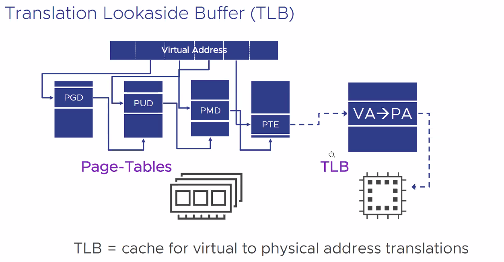

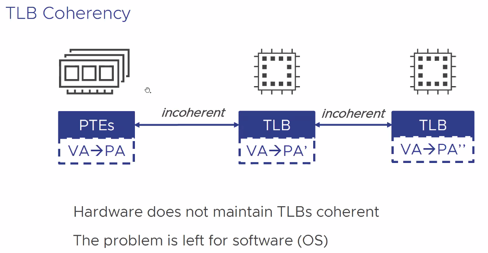

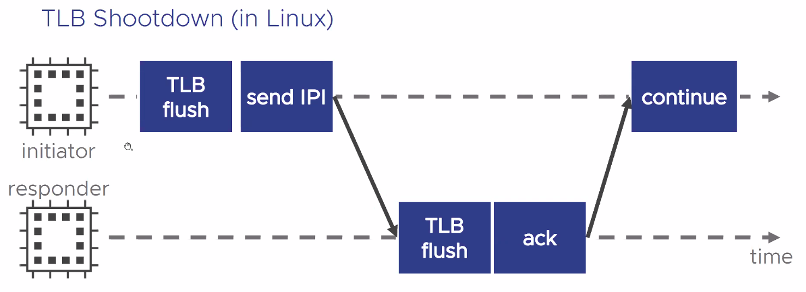

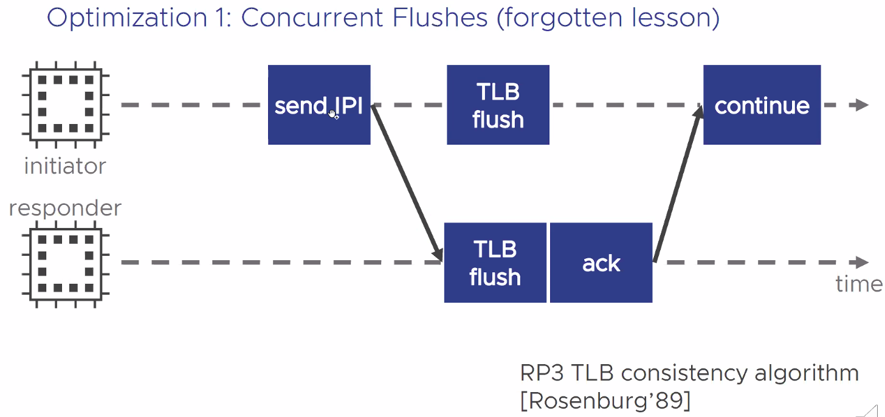

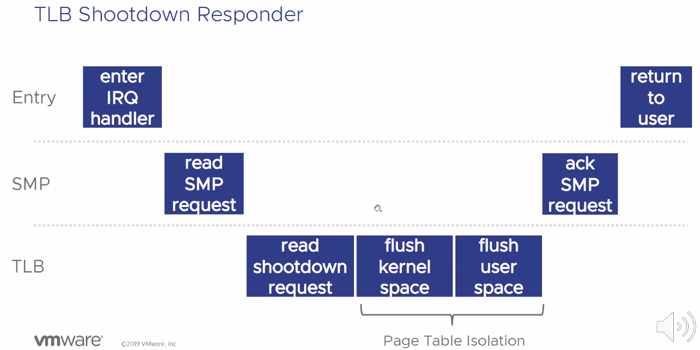

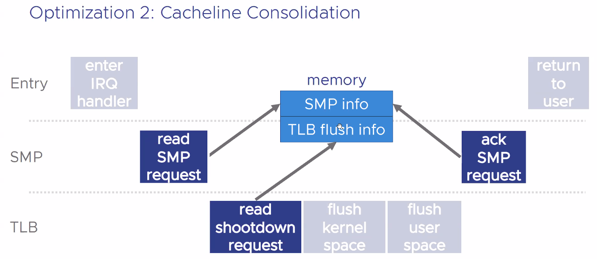

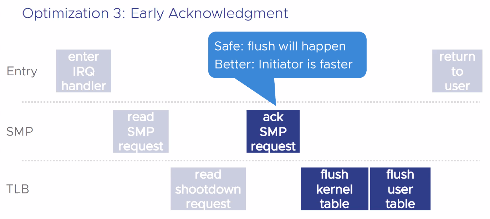

如果失败，这些页就不会被访问了

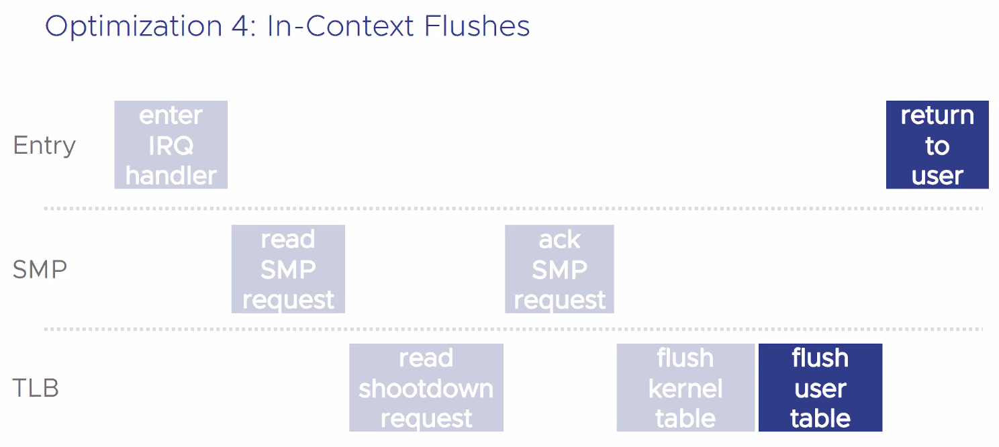

### PGAS (Partitioned Global Address Space) System

An HPC Paradigm

- DSM
  - All the memory are globally shared.
  - Interfaces: ISA instructions, e.g. `mov`

- PGAS
  - Part of the memory are globally shared.
  - Interfaces: defined by framework, e.g., `read()`, `write()`, `compare_and_swap()` or language extensions converted to function calls by the compiler.

比如说，在一个分布式系统里，只共享一部分内存，而不是共享所有

PAGS Language
- D: Dialect; L: New language; MW: Middleware, 

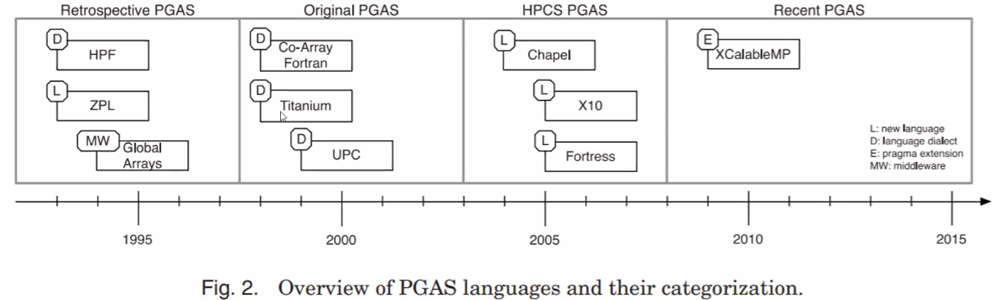

PAGS Runtime

```c
gaddr addr = Malloc(sizeof(int));
int a = Read(addr);
Write(addr, a + 1);
Free(addr);
```

Overview of Grappa

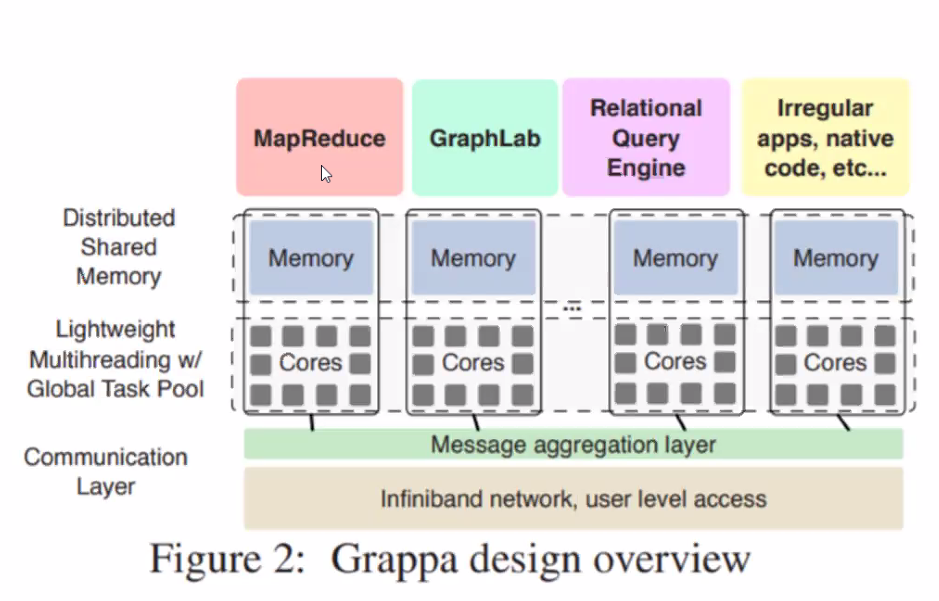

- Grappa runs on multiple cores: inter-node or intra-node.
- There're multiple tasks running on a core.
  - Task scheduling is based on a user-level co-routine, i.e., kernel-free.
- The communication is based on MPI (either inter-node or intra-node).
- Small messages are aggregated (batched).
- Applications are built atop Grappa APIs.

Two Examples: Character Count and Graph Computing

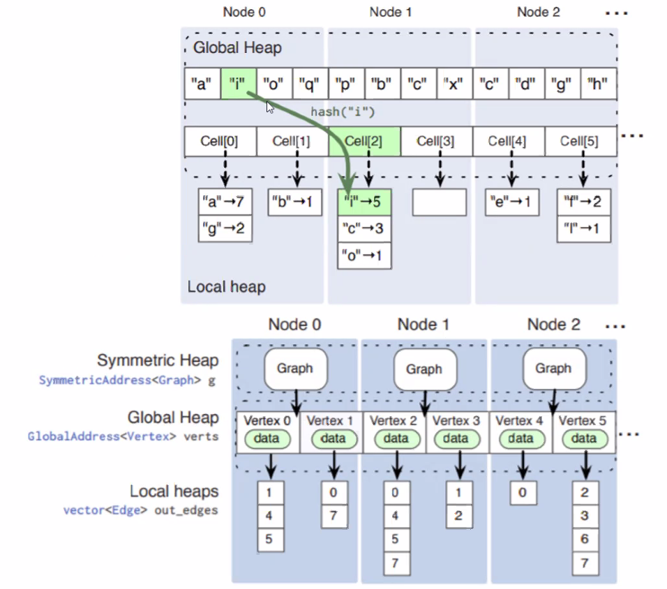

- Data distribution
  - Globally shared data: graph topology
  - Global data: characters, vertices/edges value
  - Private data: the number of each characters, neighbors
- Each core holds/owns a portion of characters/vertices, i.e., the accesses to a specific character must be delegated to the owner. (No Cache!)

Message Aggregation

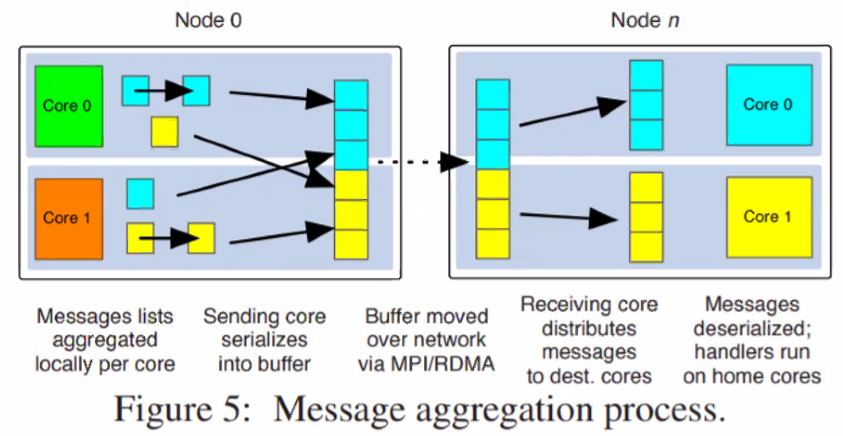

- Simple math
  - Overhead(O) = Fixed Overhead(F) + Payload(P)
  - n small messages: O = n*F + n*(P/n)
  - 1 large aggregated message: O = F + P
- Per-core message lists are better than per-node lists.
  - Cache contention?

Efficient Distributed ......

An Ivy protocol
- Home node: Manager
- Owner node: Owner

Race Condition
- 1. One thread on a node asks for a cacheline, and another thread on the same node asks for the same cacheline.
  - Block one of the threads to reduce the resources consumption.

- While a request node sends a WRITE_REQ to the owner node, the owner sends an INVALIDATION_REQ to the owner node.
  - DEADLOCK!
  - The invalidation server should be lock-free...

## 2020/5/20

### Graph representation learning for image retrieval

MANCHINE LEARNING WITH GRAPHS
- Classical ML tasks in graph networks
  - Node classification
  - ...

EXAMPLES: LINK PREDICTION

常用于推荐系统

THE VERY FIRST NETCESSITY FOR TACKLING THE ABOVE-MENTIONED PROBLEM-NODE PRESENTATION
- 图学习的第一步：如何把问题转化为图中的一个个点

NODE EMBEDDING
- Intuition: Find embedding of nodes to dimensions so that ...

SETUP
- Assueme we have a graph G:
  - V is the vertex set
  - A is the adjacency matrix (assume binary)
  - No node features or extra...

EMBEDDING NODES
- Goals is to encode nodes so that similarity in the embedding space (dot product) approximates similarity in the original network.

HOW TO DEINE NODE SIMILARITY
1. Adjacency-based similarity
2. Multi-hop similarity
3. Randomwalk similarity

ADJECENCY-BASED SIMILARIY
- Similarity function is just the edge weight between u and v in the original network.
- Intuition 

NEIGHBORDHOOD "CONVOLUTIONS"
- Neighborhood aggregation can be viewed as a center-surround filter.
- Mathematically related to spectral graph convolutions

GRAPH NEURAL NETWORK FOR IMAGE RETRIEVAL
- SGGNN

### Ceph

## 2020/5/27

似乎有人想把所有外设的接口统一到一个内存协议下。

### Yosemite V3 - Intel & Facebook

做边缘计算的东西？

### Seagate

- 20TB HAMR
- MACH.2

双磁臂？

### Samsung

- PM9A3 PCIe 4.0 SSD: U.2 M.2 E1.S
- Smart SSD
  - PCIe 3.0x4 2.5" 3.84TB
  - Xilinx Kintex UltraScale+ KU15P FPGA
  - Drivers: OpenCL & Xilinx Runtime

- Ethernet SSD
  - dual-port 25GbE
  - RDMA (RoCE and iWARP)
  - Designed to support future protocols and applications
    - NVMe-over-TCP
  - 1500K IOPS @ 4K Random Read

- SamsungProject Poseidon
  - Hardware
  - +User-space Storage OS for Empowering NVMe-oF Interface

### Sol: Fast Distributed Computation Over Slow Networks

Execution Engine: Core of ...
- 分布式系统用来分配任务的东西

Impact of Networks on Latency-sensitive Jobs

How to Push Tasks w/ Dependencies?
- Sol improve utilization by pushing with speculation
  - E.g. historical information

### SLOG: Seria...

Geo Distribution
- Client access has geo locality in most cases

Current Solutions - Locality Utilization

Multi-home Transaction
- append to local log
- append to local global log
