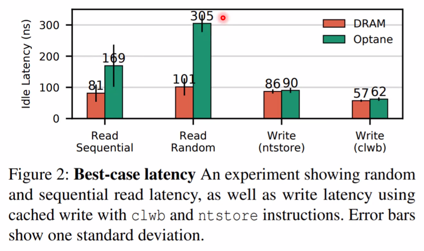

# 会议笔记

## 2020/2/26

### AIS-AI

#### PCIe Switch

#### DCGM

- DCGM (Data Center GPU Manager):

##### SM 分配策略

- cuda sample mm as example, 调整 grid size， 逐步提升 threadblock

#### HARP

异构资源池 Heterogeneous Architecture Resource Pool

- 解决用于机器学习的 GPU 集群中, GPU 利用率低, 和资源碎片化的问题.

#### HARP: Related Work

- DNN cluster schedulerss
  - Bytedance: ByteScheduler' SOSP19[8]
  - Tiresias' NSDI19[9]

- CUDA API remote / forward
  - Tecent: GaiaGPU' ISPA19[10]
    - vCUDA, not remote
  - VMware: Bitfusion (FlexDirect)
  - Orion: Orion
    - Do not have effective scheduling

#### TRTIS

TensorRT Inference Server
- TensorRT: NVIDIA 推理模型优化器

## 2020/3/11

### 论文 貌似是和神经网络有关

#### 霍夫曼编码与神经网络

### 网络剪枝

本质上就是重要性排序。

- 基于度量标准的剪纸
  - Weight
  - Activation
  - Gradient
  - Energy Consumption
  - Latency
- 基于重建误差的剪枝
- 基于稀疏训练的剪枝
- 随机修剪

### Exploring Shared Virtual Memory for FPGA Accelerators with a Configurable IOMMU

#### Motivation

- Drawbacks of copy-based memory sharing
  - Static splitting on limited memory
  - Not suitable for pointer-rich application
  - Coherency problems reduce performance
- IOMMU is not properly used
  - Lack of software support

#### Contribution

- A softare SVM manager running on the host.
- A parameter......

#### Architecture


#### SVM Management

- Flexible configuration
  - Range of mapped memory
- Worker thread
  - Pin allocated pages

#### IOTLB


#### Single Cycle L1 TLB

- Full-associated
- Flexible
- Low latency (1 cycle)
- High resource consumption
- In practice, L1 TLB is limited to 64 entries (to achieve acceptable frequency)

#### Multi-Cycle L2 TLB

- Set-Associated
- ...

#### Hybrid TLB

- Non-block translation
- Reordering when burst < L2 TLB

#### Real Traffic Patterns

- Pointer-Chasing (PC)
- Random Forest Traversal (RTF)
- Mem Copy (MC)
- Sparse Matrix-Vector Multiplication (SMVM)

## 2020/3/18

### Rich RT Process = RT Process + Rich (Linux) Features


### gVisor & Firecracker


> Code Coverage 可以用韦恩图来表示不同框架的 Code Coverage。
> 哪怕一个工程问题，也可以跑一跑，测一下数据，总结一些结论。

进程级容器性能 vs 虚拟机性能？


容器竟然比虚拟机慢？

### Serverless applications booting are slow!

- The execution takes several seconds while the initialization takes several seconds, too...
- Sandox initialization + application initialization (JVM, Python interpreter...)


总之就是 Serverless 应用启动速度太慢了。

#### Three Paths


总之就是能共享就共享。

- Warm Boot (middle path)
  总之就是 Copy On Write 的思想。
  
- Fork Boot (fast path)
  - Vanilla fork is infeasible:
    - Only single-thread is supported.
    - Consider thread0 calls fork while thread1 holds a mutex, what will happen?
    - The forked thread has a locked mutex which no one will release it!
  - Vanilla clone is infeasible:
    - MAP_SHARED violates the security constraint.

解决方案


#### Namespace

- OverlayFS: in-memory FS, copied automatically by sfork.
- And Log need persistency.

### Migration Support for SR-IOV?


迁移的时候，SR-IOV 无法热迁移，要迁移的话，要把 Guest Module 切换为 VirtIO 模式。

### Direct Timer and IPIs


### X-Dragon


### Vulnerability Fixing: one by one

- Safety of the VMFUNC instructions

## 2020/3/25

### C-LSTM: Enabling Efficient LSTM using Structured Compression Techniques on FPGAs

RNNs 应用场景

- Machine Translation
- Voice Control
- Music Composition
- Image Caption

LSTM - Long Short Term Memory neural Network

Google LSTM

  - Large Model Size
  - 总之模型越来越大 所以在模型层面做压缩 再是硬件优化

Compression Techniques Overview

  Model Compression Techniques
  - Parameter Pruning
    如果只是减少参数的话，会
    - Unbalanced Workload
    - Extra Storage Footprint
    - Irregular Memory Access
  - Quantization
  - Structure Matrix
    结构化矩阵 实际上用的是循环矩阵
    - Circulan Matrix
    - Circulant Convolution 总之是把矩阵划块

  Model Training
  - Varying Circulant Matrix Block Size k
    trade off between compression ratio and ?

Operator Scheduler

Synthesis Backend

#### Conclusion

Circulant Matrix Compression

LSTM Inference Engine 

### AEP & JVM

- Optane 方面研究
- Optane + JVM

#### Espresso: Brewing Java For More Non-Volatility with Non-volatile Memory

Two persistence management approaches in Java

- Fine-grained Persistence with PC
  - Using a separate native NVM environment to store persistent data
- Costly management of two heaps
  - real data manipulation only accounts for 1.8% over the whole execution time

Persistent Java Heap


  - Fine-grained Persistence with PJH
    - adding an additional persistent heap
  - Metadata area
  - Name table.
  - Data heap and Klass segment.
  - APIs: createHeap, loadHeap, pnews

#### AutoPersist: An Easy-To-Use Java NVM Framework Based on Reachability

AutoPersist - durable root
- All objecs reachable from the durable root set must be in NVM.
- All objecs reachable from the durable root set must be automatically persisted when modified.


AutoPersist - Moving object
- Moving object at runtion


AutoPersist - Moving object

#### An Empirical Guide to the Behavior and Use of Scalable Persistent Memory

4个使用 Optane 的建议





## 2020/4/1

- High-density Multi-tenant Bare-metal Cloud
- Lightweight kernel isolation with virtualization and VM functions

### Optimizing Nested Virtualization Performance Using Direct Virtual Hardware

嵌套虚拟化

- A technique to run a virtual machine (VM) inside a VM

嵌套虚拟化性能过差

- Single-level virtualization performs close to native execution
- Many times(10~) slower in Nested Virtualization

Direct Virtual Hardware


- Virtual-passthrough
  
  - Place virtual I/O devices at L0 hypervisor
  - Support running many VMs without special hardware
  - Support VM live migration
- Virtual Timers
  - Additional Per-vCPU virtual timer at L0 hypervisor
  - Remap the virtual timer to hardware timers for nested VMs

> Posted Interrupt
> - Hardware feature allowing Exitless interrupt receiving
> - PI descriptor and PI notification vector (in VMCS)

- Virtual IPI
  
- Recursive DVH
  - DVH is easily set up in multiple levels of nested VMs
  - Combined mappings 

### How to Copy Files

华为和VMware？

#### New Thrends

- Open-Channel SSD
- In Storag Computing
- Zoned FS 对于机械硬盘特别优化的文件系统？

#### Generation of filesystems

0. No systems at all.
1. Early random access.
2. Early organization (aka folders)
3. ...

#### Next Generation and New File systems

- XFS, ZFS, BtrFS, BetrFS
- New FS:
  - F2FS, for flash storage
  - ZoneFS, for zoned namespace (ZNS) NVMe SSD
  - for optane?

- XFS
- ZFS
  - Features
    - Atomic COW snapshots
    - Per-block checksuming
    - Self-healing redundant arrays
    - Volume management
  - Legaal problem: Oracle. linus说别用
- BtrFS
  - Implemented with B+ tree
  - Low Performance compared to others
  - Many features are very buggy
- BetrFS
  - B epsilon tree

#### 修改 B epsilon tree 来提升空间利用率？

B epsilon - DAGs and Small Writes

- Copy-on-Abundant-Write
- Performance Goals

#### Conclusions

- transform copy-on-write into copy-on-abundant-write

## 2020/4/15

### GPU Code Generation with Scheduling

```python
# compute description
def vector_add(A, B):
    C = compute((...))
```

```cpp
/* Real code running is cpp. */
```

总之是自动优化。大多是匹配一下某种模式。

### Related Works -- Halide

- Separate Compute and Schedule
- Generate low-level code automatically
- Focus on image-processing
- Auoscheduler mainly

实际上就是模式匹配？

### Related Works -- TVM

- Separate Compute and Schedule
- Generate 

### Limitatinos of Writing Schedules

- Many primitives to choose.
- Complex combinations & huge parameter space.

大概意思是随便变一下方法，可能

### Motivations

An Ideal Framework:

- Auto-optimization
- High-performance
- Portable CPU 和 GPU 上都能用
- No low-level programming
- Shor development time

### FlexTensor Workflow


### Static Analysis

### Schedule Space Generation

- 总之肯定要剪枝，并且要把小循环组合成大循环。

### Quatization

两个主要研究方向

- 权值共享
- 权值精简
  - 从1bit到16bit都有，1bit极限方案往往精度损失较大

### Quantization and Training of Neural Networks of ...

谷歌的论文

之前方法的问题

- benchmark本身有很多冗余，容易压缩。

### Quantized Inference

