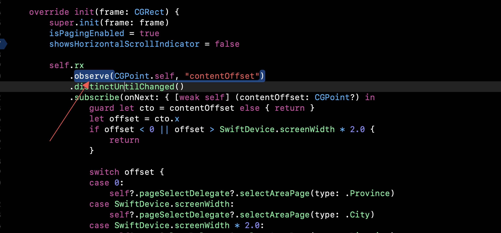
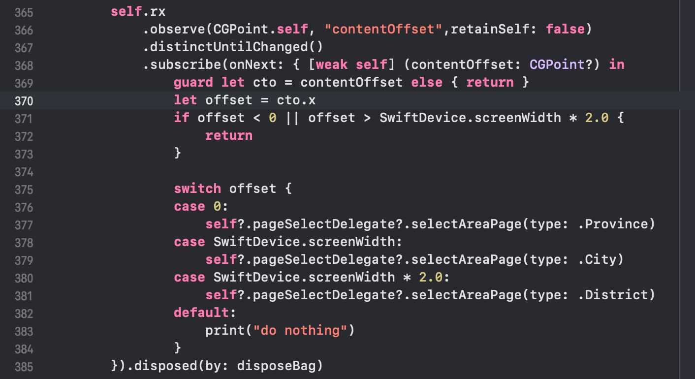

# Swift, OC, iOS 开发学习笔记

> 能记在脑子里就别记在本子上。

写这个笔记的时候请注意：
1. 不要贴公司有关的东西。
2. 不要搞流水账，只记重要的知识点。

## 一些等待你去搞清楚的问题

- CALayer 与 UIView 在动画方面的不同？
  
  似乎 CALayer 的更新时机有些微妙？

- 项目 埋点框架 源码阅读
- RxSwift 源码阅读
- IGListKit 源码阅读
- SnapKit 源码阅读

## 语法集锦

### Swift 的错误处理 try catch 与堆栈展开

> Error handling in Swift resembles exception handling in other languages, with the use of the try, catch and throw keywords. Unlike exception handling in many languages—including Objective-C—error handling in Swift does not involve unwinding the call stack, a process that can be computationally expensive. As such, the performance characteristics of a throw statement are comparable to those of a return statement.

堆栈展开 unwinding the call stack

为何说 Swift 的错误处理不涉及堆栈展开呢？

- [microsoft docs](https://docs.microsoft.com/en-us/cpp/cpp/exceptions-and-stack-unwinding-in-cpp?view=msvc-160)
- [stackoverflow 1](https://stackoverflow.com/questions/46814233/error-handling-in-swift-does-not-involve-stack-unwinding-what-does-it-mean)
- [stackoverflow 2](https://stackoverflow.com/questions/36423471/swift-vs-obj-c-exceptions-what-is-stack-unwinding-why-doesnt-swift-do-it)
  - 说明了 `try catch` 的定义，问题；说明了 Swift 的 `try catch` 并非传统意义上真的 `try catch`。

堆栈展开就是程序在处理 `try catch` 的时候，从错误抛出的地方在堆栈上一路向上找，找到处理这个错误的地方的过程。

那么为何 Swift 的 `throw` 不会涉及到堆栈展开呢？

我的**猜测**是，Swift 在语法层面强制规定，必须要在会 throw exception 的函数定义处标注上 `throws`，而调用它的过程也必须注明为 `try`，由此，**也许**在编译/运行时初始化时期，Swift 就组织起了一套数据结构，来连接起所有的 `try` 和 `throw`，让被抛出的错误可以直接根据这个数据结构找到对应的错误处理位置。因此，它的 `throw` 和 `return` 的性能其实差不多。

### 不透明类型 Qpaque Type

- [cnswift](https://www.cnswift.org/opaquetypes)
- [swift](https://docs.swift.org/swift-book/LanguageGuide/OpaqueTypes.html)

这东西的用处似乎很玄，值得注意。(总之这一章要好好看)

1. 当你在某个模块内部的计算要牵涉到一系列类型，返回的时候又不想把这些类型暴露除去，那就用不透明类型。

    如何理解？

    ```swift
    func makeTrapezoid() -> some Shape {
        /* Triangle, Square, FlippedShape, JoinedShape conform to protocol Shape. */
        let top = Triangle(size: 2)
        let middle = Square(size: 2)
        let bottom = FlippedShape(shape: top)
        let trapezoid = JoinedShape(
            top: top,
            bottom: JoinedShape(top: middle, bottom: bottom)
        )
        return trapezoid
    }
    ```

2. 当你需要一个返回值遵循某个协议，但协议中又有范型时，就使用不透明类型。

    如果协议中有范型（关联类型），那你不能将其作为返回值遵守的协议。比如下面的 Container 协议，作为容器，其中元素的类型不会指定。

    ```swift
    protocol Container {
        associatedtype Item
        var count: Int { get }
        subscript(i: Int) -> Item { get }
    }
    extension Array: Container { }
    ```

    你无法使用 Container 来直接约束一个返回值的类型：因为编译器无法知道容器元素的类型。

    ```swift
    /* Error: Protocol with associated types can't be used as a return type. */
    func makeProtocolContainer<T>(item: T) -> Container {
        return [item]
    }

    /* Error: Not enough information to infer C. */
    func makeProtocolContainer<T, C: Container>(item: T) -> C {
        return [item]
    }
    ```

    这种情况下，就要用不透明类型。(就是说，类型推断可以在不透明类型上工作)

    ```swift
    func makeOpaqueContainer<T>(item: T) -> some Container {
        return [item]
    }
    let opaqueContainer = makeOpaqueContainer(item: 12)
    let twelve = opaqueContainer[0]
    print(type(of: twelve))
    // Prints "Int"
    ```

### Swift 中的内存安全

如何保证重叠访问结构体的安全性？（可通过编译？

- 你只访问实例的存储属性，不是计算属性或者类属性；
- 结构体是局部变量而非全局变量；
- 结构体要么没有被闭包捕获要么只被非逃逸闭包捕获。

如果编译器无法保证访问是安全的，它就不允许访问。

```swift
func balance(_ x: inout Int, _ y: inout Int) {
    let sum = x + y
    x = sum / 2
    y = sum - x
}

struct Player {
    var name: String
    var health: Int
    var energy: Int
    
    static let maxHealth = 10
    mutating func restoreHealth() {
        health = Player.maxHealth
    }
}

extension Player {
    mutating func shareHealth(with teammate: inout Player) {
        balance(&teammate.health, &health)
    }
}
 
var oscar = Player(name: "Oscar", health: 10, energy: 10)
var maria = Player(name: "Maria", health: 5, energy: 10)
oscar.shareHealth(with: &maria) /* OK */
oscar.shareHealth(with: &oscar) /* Error! */

var holly = Player(name: "Holly", health: 10, energy: 10)
balance(&holly.health, &holly.energy) /* 不行！ */

/* 没问题，因为 playerInformation 是一个局部变量，可以保证不会有重叠访问。 */
func doSomething00() {
    var playerInformation = (health: 10, energy: 20)
    balance(&playerInformation.health, &playerInformation.energy)
}
```

### 单例

Swift 中，存储型的静态变量就是单例。不需要像 OC 里那么操作。

### NotificationCenter 是否需要手动移除观察者？

- [iOS 9+ NotificationCenter 还需要手动移除观察者吗？](https://zhuanlan.zhihu.com/p/32952430)
- [removeObserver(_:)](https://developer.apple.com/documentation/foundation/notificationcenter/1413994-removeobserver)

总之，如果是用 `addObserver(forName:object:queue:using:)` 添加的观察者（即 Block-based Observer）需要手动移除（`removeObserver(_:name:object:)`）。
而在 iOS 9.0 或 macOS 10.11 以后，使用 `addObserver(_:selector:name:object:)` 添加的观察者（即 Selector-based Observer）由系统进行移除。

苹果的文档里提到，对于一个长期存在的 object，不应该移除其所有的观察者，毕竟你为其添加观察者的代码可能只会执行一次。

### 数组具有值语义

当你把一个已经存在的数组赋值给另一个变量时，这个数组的内容会被“复制”。

```swift
var x = [1,2,3]
var y = x
y.append(4)
y // [1, 2, 3, 4]
x // [1, 2, 3]
```

## CodeStyle 集锦

### 使用 guard 来尽早退出方法

### 避免手动计算索引

### 结构体中尽量不要使用延迟属性

访问一个延迟属性是 mutating 操作，因为这个属性的初始值会在第一次访问时被设置。

当结构体包含一个延迟属性时，这个结构体的所有者如果想要访问该延迟属性的话，也需要将结构体声明为可变量，因为访问这个属性的同时，也会潜在地对这个属性的容器进行改变。

所以，下面的代码是不被允许的。

```swift
let immutablePoint = Point(x: 3, y: 4) 
immutablePoint.distanceFromOrigin
// 错误:不能在一个不可变量上使用可变 getter
```

让想访问这个延迟属性的所有 Point 用户都使用 var 是非常不方便的事情，所以在结构体中使用延迟属性通常不是一个好主意。

### lazy 关键字不会进行多线程同步

lazy 关键字不会进行任何线程同步。如果在一个延迟属性完成计算之前，多个线程同时尝试访问它的话，计算有可能进行多次，计算过程中的各种副作用也会发生多次。

## iOS 集锦

### UIView 动画与 CALayer

### 侧滑返回手势与横向 UIScrollView

- [iOS侧滑返回和UIScrollView手势冲突如何解决](https://juejin.cn/post/6844903687454720014)

### 禁用粘贴

### 表情输入？禁止！

### tableview 滚动至指定行的问题？

### hitTest 中的调用似乎不能立即滚动 collectionView？需要延迟？

### IGListKit 似乎推荐把 isPrefetchingEnabled 设为 false

https://instagram.github.io/IGListKit/working-with-uicollectionview.html

> In iOS 10, a new cell prefetching API was introduced. At Instagram, enabling this feature substantially degraded scrolling performance. We recommend setting isPrefetchingEnabled to NO (false in Swift). Note that the default value is true.
> 
> You can set this globally using UIAppearance:

```objc
if ([[UICollectionView class] instancesRespondToSelector:@selector(setPrefetchingEnabled:)]) {
    [[UICollectionView appearance] setPrefetchingEnabled:NO];
}
```

```swift
if #available(iOS 10, *) {
    UICollectionView.appearance().isPrefetchingEnabled = false
}
```

### UITextView 去除内边距

```swift
addressView.textContainer.lineFragmentPadding = 0 // 左右边距
addressView.textContainerInset = UIEdgeInsets.zero // 上下边距
```

### 类用 rx.observe 观察自己的属性时，要避免循环引用



使用 rx.observe 时，需要注意: 如果一个类观察自己的属性，使用 rx.observe 将会产生循环引用。因为默认会retain被观察者. 可以在observe时retainSelf 指定为false。



## 功能集锦

## 问题集锦

1. statusbar、横屏 背后逻辑调查
2. rxswift 数组内对象 值 观察
3. 最基本的设计：vc和vm之间如何互相操作？