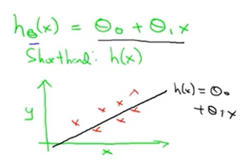

# 吴恩达 机器学习 课程笔记

## Chapter 1 - Introduction

### Machine learning algorithms

- Supervised learning
- Unsupervised learning

Others: Reinforcement learning 强化学习, recommender systems 推荐系统.

### Example: Housing price prediction

- Supervised Learning: "right answer" given
  
  这里涉及到 Regression Problem : Predict continuous valued output (price)
  总之是要预测连续值的属性

### Example: Breast cancer

根据肿瘤的大小，预测是良性还是恶性

涉及到 Classification Problem : Discrete valued output (0/1)
要预测离散的值

> cocktail party 鸡尾酒会

## Chapter 2 - Univariate Regression

### Model Description

课程中常用的符号

- m = Number of training examples
- x's = "input" variable / features
- y's = "output" variable / "target" features

比如，对于下面的数据集，m为4。

| Size in feet^2 (x) | Price ($) in 1000's (y) |
| - | - |
| 2104 | 460 |
| 1416 | 232 |
| 1534 | 315 |
| 852  | 178 |

(x, y) 某一个训练样本
(x(i), y(i)) 第i行的训练样本

```
             Training Set
                  |
                  V
           Learning Algorithm
                  |
                  V
Size of --> h (hypothesis) --> Estimated
house                          price
```

主要问题是，我们如何表示h？



这种类型的h，我们称为 linear regression with one variable 一元线性回归，或者 Univariate linear regression 单变量线性回归。

### Cost Function

代价函数

对于上面那个线性回归的例子

Hypothesis: h(x) = a + b * x

我们希望 h(x) - y 尽可能小

