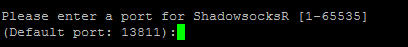
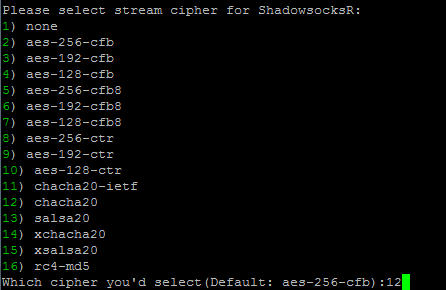

# FANQIANG 大作战

## SSR

1. 下载一键搭建ssr脚本
   ```bash
   git clone -b master https://github.com/flyzy2005/ss-fly
   ```

2. 运行搭建ssr脚本代码
   ```bash
   ss-fly/ss-fly.sh -ssr
   ```

3. 输入对应的参数

   执行完上述的脚本代码后，会进入到输入参数的界面，包括服务器端口，密码，加密方式，协议，混淆。可以直接输入回车选择默认值，也可以输入相应的值选择对应的选项：

   全部选择结束后，会看到如下界面，就说明搭建ssr成功了：
   ```bash
   Congratulations, ShadowsocksR server install completed!
   Your Server IP        :你的服务器ip
   Your Server Port      :你的端口
   Your Password         :你的密码
   Your Protocol         :你的协议
   Your obfs             :你的混淆
   Your Encryption Method:your_encryption_method

   Welcome to visit:https://shadowsocks.be/9.html
   Enjoy it!
   ```

4. 相关操作ssr命令

   - 启动：`/etc/init.d/shadowsocks start`
   - 停止：`/etc/init.d/shadowsocks stop`
   - 重启：`/etc/init.d/shadowsocks restart`
   - 状态：`/etc/init.d/shadowsocks status`

   - 配置文件路径：`/etc/shadowsocks.json`
   - 日志文件路径：`/var/log/shadowsocks.log`
   - 代码安装目录：`/usr/local/shadowsocks`

5. 卸载ssr服务
   ```bash
   ./shadowsocksR.sh uninstall
   ```

## SS

本脚本适用环境：
系统支持：CentOS/Debian/Ubuntu 内存要求：≥128M
日期：2017 年 07 月 28 日

关于本脚本：
一键安装 libev 版的 Shadowsocks 最新版本。该版本的特点是内存占用小（600k左右），低 CPU 消耗，甚至可以安装在基于 OpenWRT 的路由器上。

默认配置：
服务器端口：自己设定（如不设定，默认为 8989）
密码：自己设定（如不设定，默认为teddysun.com）
加密方式：自己设定（如不设定，默认为 aes-256-gcm）

客户端下载：
[https://github.com/shadowsocks/shadowsocks-windows/releases](https://github.com/shadowsocks/shadowsocks-windows/releases)

使用方法：
使用root用户登录，运行以下命令：

### CentOS

```
wget --no-check-certificate https://raw.githubusercontent.com/teddysun/shadowsocks_install/master/shadowsocks-libev.sh
chmod +x shadowsocks-libev.sh
./shadowsocks-libev.sh 2>&1 | tee shadowsocks-libev.log
```

### Debian && Ubuntu

```
wget --no-check-certificate https://raw.githubusercontent.com/teddysun/shadowsocks_install/master/shadowsocks-libev-debian.sh
chmod +x shadowsocks-libev-debian.sh
./shadowsocks-libev-debian.sh 2>&1 | tee shadowsocks-libev-debian.log
```

安装完成后，脚本提示如下：

```
Congratulations, shadowsocks-libev install completed!
Your Server IP:your_server_ip
Your Server Port:your_server_port
Your Password:your_password
Your Local IP:127.0.0.1
Your Local Port:1080
Your Encryption Method:aes-256-cfb

Welcome to visit:http://teddysun.com/357.html
Enjoy it!
```

卸载方法：
使用 root 用户登录，运行以下命令： ``./shadowsocks-libev.sh uninstall``

使用命令：
启动：`/etc/init.d/shadowsocks start`
停止：`/etc/init.d/shadowsocks stop`
重启：`/etc/init.d/shadowsocks restart`
查看状态：`/etc/init.d/shadowsocks status`

参考链接：
[https://github.com/madeye/shadowsocks-libev](https://github.com/madeye/shadowsocks-libev)
[https://shadowsocks.be/4.html](https://shadowsocks.be/4.html)

## 一键式SSR

1. 输入命令

   ```bash
   $ wget --no-check-certificate -O shadowsocks-all.sh https://raw.githubusercontent.com/teddysun/shadowsocks_install/master/shadowsocks-all.sh
   $ chmod +x shadowsocks-all.sh
   $ ./shadowsocks-all.sh 2>&1 | tee shadowsocks-all.log
   ```

2. 接下来选择参数

   

   

   

   

   这里的混合方式建议选择md5以下的。

   

   

   

   

   最后的各种信息一定要记好......

## Linux终端使用SSR客户端

[在Linux终端使用SSR服务实现科学上网](https://samzong.me/2017/11/17/howto-use-ssr-on-linux-terminal/)

昨天在群内看到有朋友在询问如何在Linux终端内使用SSR来实现科学上网，所以抽空研究了下在Linux中如何使用，本文参考了Otokaze 和 Django 两位的博客，文章链接在博文最后；SSR服务提供商依然采用了ssGlobal，在Google的过程中，找了不少解决方案，这里仅做一种简单整理，实验操作系统有CentOS 7.4 & Ubuntu 16.04.3。

### ssr 代理服务

#### 下载

```bash
# 需要本地git 环境
yum install -y git
git clone https://github.com/SAMZONG/gfwlist2privoxy.git
cd gfwlist2privoxy/
mv ssr /usr/local/bin
chmod +x /usr/local/bin/ssr
```

#### 安装配置

```bash
[root@localhost ~]# ssr install
Cloning into '/usr/local/share/shadowsocksr'...
remote: Counting objects: 5490, done.
remote: Total 5490 (delta 0), reused 0 (delta 0), pack-reused 5490
Receiving objects: 100% (5490/5490), 1.71 MiB | 410.00 KiB/s, done.
Resolving deltas: 100% (3799/3799), done.

[root@localhost ~]# ssr config 		# 配置文件路径 /usr/local/share/shadowsocksr/config.json
{
    "server": "0..0.0.0",	// ssr服务器ip
    "server_ipv6": "::",
    "server_port": 8080,	// ssr服务器端口
    "local_address": "127.0.0.1",
    "local_port": 1080,

    "password": "123456",		// 对应password
    "method": "none",			// 这里对应SSGlobal配置中的Encryption
    "protocol": "auth_chain_a",		//对应protocl
    "protocol_param": "",
    "obfs": "http_simple",		//对应obfs
    "obfs_param": "hello.world",	//对应obfs_param
    "speed_limit_per_con": 0,
    "speed_limit_per_user": 0,

    "additional_ports" : {}, // only works under multi-user mode
    "additional_ports_only" : false, // only works under multi-user mode
    "timeout": 120,
    "udp_timeout": 60,
    "dns_ipv6": false,
    "connect_verbose_info": 0,
    "redirect": "",
    "fast_open": false
}
```

#### 启动/关闭

```bash
ssr start
ssr stop
```

#### 卸载

```bash
ssr uninstall # 这里操作会删除/usr/local/share/shadowsocksr
```

以上，本地监听服务已经配置完成了，在填写的过程中，要注意你的本地监听地址和监听端口，默认是127.0.0.1:1080，如果你修改了设置，那么在后续配置中也要配合修改。

### Privoxy 配置

首先，需要安装privoxy

CentOS 7.4

```bash
yum install -y epel-release
yum install -y privoxy
```

Ubuntu 16.04

```bash
apt install -y privoxy
```

#### 全局模式

代理模式同其他平台上方式，将所有http/https请求走代理服务，如果需要全局代理的话按照如下操作即可，如果要使用PAC模式，请跳过此部分。

```bash
# 添加本地ssr服务到配置文件
echo 'forward-socks5 / 127.0.0.1:1080 .' >> /etc/privoxy/config

# Privoxy 默认监听端口是是8118
export http_proxy=http://127.0.0.1:8118
export https_proxy=http://127.0.0.1:8118
export no_proxy=localhost

# 启动服务
systemctl start privoxy.service
```

#### PAC模式

使用GFWList是由AutoProxy官方维护，由众多网民收集整理的一个中国大陆防火长城的屏蔽列表，这里感谢@Otokaze 为我们提供了转换shell自动转换脚本，为了方便修改，我fork了这个项目，将这篇教程所用到的资源进行了汇总，你可以在最开始git clone的目录中找到执行脚本。

```bash
[root@localhost ~]# cd gfwlist2privoxy/
[root@localhost gfwlist2privoxy]# ls
gfw.action  gfwlist2privoxy  README.md  ssr
[root@localhost gfwlist2privoxy]# bash gfwlist2privoxy
proxy(socks5): 127.0.0.1:1080		# 注意，如果你修改了ssr本地监听端口是需要设置对应的
{+forward-override{forward-socks5 127.0.0.1:1080 .}}

=================================================================

"cp -af /root/gfwlist2privoxy/gfw.action /etc/privoxy/"

[root@localhost ~]# cp -af gfw.action /etc/privoxy/
[root@localhost ~]# echo 'actionsfile gfw.action' >> /etc/privoxy/config

# Privoxy 默认监听端口是是8118
export http_proxy=http://127.0.0.1:8118
export https_proxy=http://127.0.0.1:8118
export no_proxy=localhost

# 启动服务
systemctl start privoxy.service
```

#### proxy 环境变量

```bash
# privoxy默认监听端口为8118
export http_proxy=http://127.0.0.1:8118
export https_proxy=http://127.0.0.1:8118
export no_proxy=localhost

# no_proxy是不经过privoxy代理的地址
# 只能填写具体的ip、域名后缀，多个条目之间使用','逗号隔开
# 比如: export no_proxy="localhost, 192.168.1.1, ip.cn, chinaz.com"
# 访问 localhost、192.168.1.1、ip.cn、*.ip.cn、chinaz.com、*.chinaz.com 将不使用代理
```

#### 代理测试

```bash
# 访问各大网站，如果都有网页源码输出说明代理没问题
curl -sL www.baidu.com
curl -sL www.google.com
curl -sL www.google.com.hk
curl -sL www.google.co.jp
curl -sL www.youtube.com
curl -sL mail.google.com
curl -sL facebook.com
curl -sL twitter.com
curl -sL www.wikipedia.org

# 获取当前 IP 地址
# 如果使用 privoxy 全局模式，则应该显示 ss 服务器的 IP
# 如果使用 privoxy gfwlist模式，则应该显示本地公网 IP
curl -sL ip.chinaz.com/getip.aspx
```

#### 管理脚本

在以上部署操作完成后，应该已经可以正常科学上网了，但是如果需要进行管理时，需要分别管理ssr和privoxy，为了方便管理，这里写了一个shell脚本方便管理: ssr_manager

```bash
#!/bin/bash
# Author Samzong.lu

case $1 in
	start)
		ssr start &> /var/log/ssr-local.log
		systemctl start privoxy.service
		export http_proxy=http://127.0.0.1:8118
		export https_proxy=http://127.0.0.1:8118
		export no_proxy="localhost, ip.cn, chinaz.com"
		;;
	stop)
		unset http_proxy https_proxy no_proxy
		systemctl stop privoxy.service
		ssr stop &> /var/log/ssr-log.log
		;;
	autostart)
		echo "ssr start" >> /etc/rc.local
		systemctl enable privoxy.service
		echo "http_proxy=http://127.0.0.1:8118" >> /etc/bashrc
		echo "https_proxy=http://127.0.0.1:8118" >> /etc/bashrc
		echo "no_proxy='localhost, ip.cn, chinaz.com'" >> /etc/bashrc
		;;
	*)
		echo "usage: source $0 start|stop|autostart"
		exit 1
		;;
esac
```

#### 使用

```bash
mv gfwlist2privoxy/ssr_manager /usr/local/bin
chmod +x ssr_manager

# 启动服务

ssr_manager start

# 关闭服务

ssr_manager stop 

# 添加开机自启动

ssr_manager autostart
```

参考链接

[https://www.zfl9.com/ss-local.html](https://www.zfl9.com/ss-local.html)

[https://www.djangoz.com/2017/08/16/linux_setup_ssr/](https://www.djangoz.com/2017/08/16/linux_setup_ssr/)