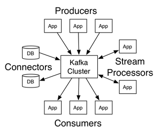
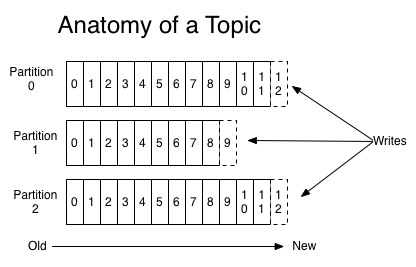

# Kafka
- 2019/6/25
> [Apache Kafka](http://kafka.apache.org/) is a distributed streaming platform.
## Introduction
- Kafka is run as a cluster on one or more servers that can span multiple datacenters.
- The Kafka cluster stores streams of **records** in categories called **topics**.
- Each record consists of a **key**, a **value**, and a **timestamp**. 
## Core APIs
- Producer API
- Consumer API
- Streams API
- Connector API

In Kafka the communication between the clients and the servers is done with a simple, high-performance, [language agnostic](#notes1) **TCP** protocol.

## Topics and Logs
A **topic** is a category or feed name to which records are published. Topics in Kafka are always **multi-subscriber**; that is, a topic can have zero, one, or many consumers that subscribe to the data written to it.

For **each topic**, the Kafka cluster maintains **a partitioned log** that looks like this:

Each partition is an ordered, immutable sequence of records that is continually appended to a structured commit log. The records in the partitions are each assigned a sequential id number called the **offset** that uniquely identifies each record within the partition.

The Kafka cluster durably persists all published records whether or not they have been consumed using a configurable **retention period**. For example, if the retention policy is set to two days, then for the two days after a record is published, it is available for consumption, after which it will be discarded to free up space. *Kafka's performance is effectively constant with respect to data size so storing data for a long time is not a problem.*

In fact, the only metadata retained on a per-consumer basis is the offset or position of that consumer in the log.
## Notes
### language agnostic
语言无关的。agnostic有不可知论的意思。